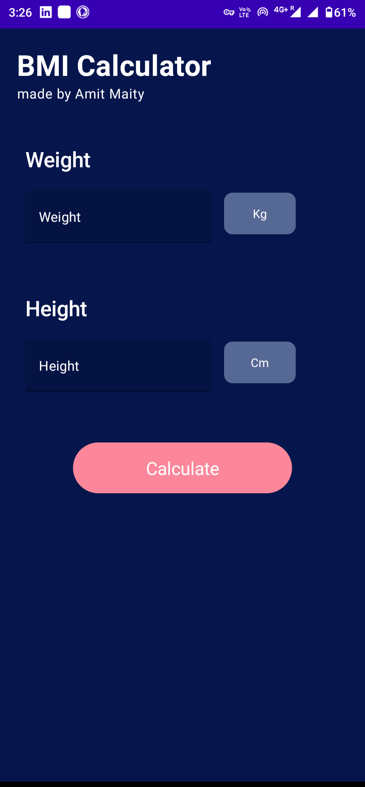
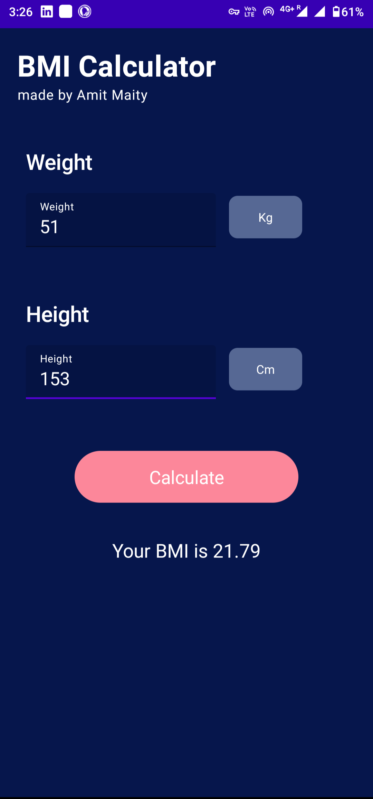
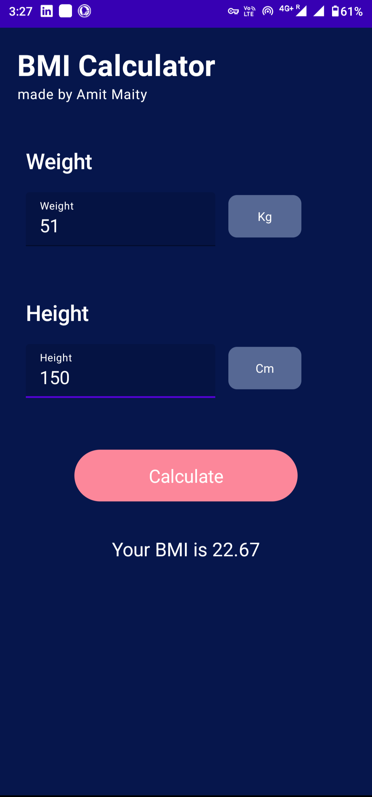

# BMI Calculator ( Using - Jetpack Compose )

[⬇️Download App](https://drive.google.com/file/d/1OXT7n2-iT-DbYn90jI0qzz9MS6RDLmcr/view?usp=sharing)

|||
|:----------------------------------------:|:-----------------------------------------:|
|  </a> <a href="https://www.java.com" target="_blank"> |  </a> <a href="https://www.java.com" target="_blank">  |
 
 ## 🤔 What is this App
 
 ✍️ Here is "BMI Calculator". You can view your BMI by inputting your height and weight with just one click.
 
 ## 💡 Features Used

1. JetPack Compose (Kotlin)

<h1 align=center> Project Admin  🤵 </h1>

  

  

  

  &nbsp;&nbsp;&nbsp;&nbsp;
  &nbsp;&nbsp;&nbsp;&nbsp;
  &nbsp;&nbsp;&nbsp;&nbsp;

  
   
  
  ## 📸 Screenshots
 

 

||||
|:----------------------------------------:|:-----------------------------------------:|:-----------------------------------------:|
|  |  |  |
  
  
  
  <h2 align="center">📝 Created by </h2>

<h3>Amit maity</h3>

  
 
  
  
  
   
